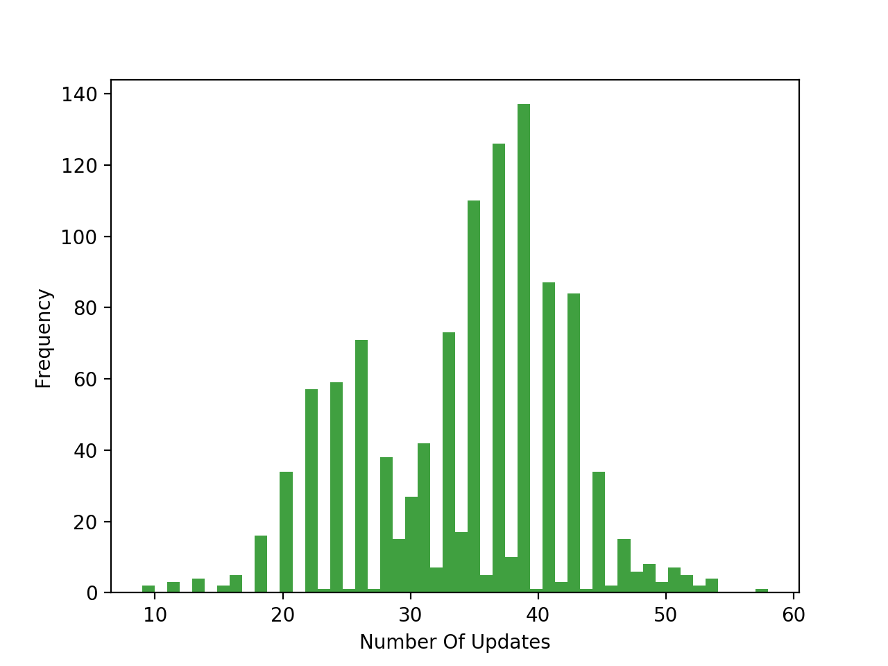

# Machine Learning Foundations - HW1

###### By: Wu-Jun Pei (B06902029)

### 1.

### 2.

It is easy to observe that
$$
\begin{align*}
E_{OTS} &= \frac 1 L \times (\text{number of even numbers in $[N + 1, N +L]$}) \\
&= \frac 1 L \times (\lfloor \frac {N + L} 2 \rfloor - \lfloor \frac N 2 \rfloor)
\end{align*}
$$

### 3.

Since those every $f$ are equally in probability, given $D$, there are still $2^L$ $f$'s generating different outputs of the test input. Let $g_1$ be the hypothesis generated from $A_1$ and $g_2$ be the hypothesis generated from $A_2$. It is easy to observe that the expected value of $E_{OTS}$ is 0.5.
$$
\begin{align*}
\mathbb{E}_f \{E_{OTS}(g_1, f)\} = \mathbb{E}_f \{E_{OTS}(g_2, f)\} = \frac 1 2
\end{align*}
$$

### 4.

If $v \le 0.1$, than the number of orange marbles is either 0 or 1. So the probability is
$$
\begin{align*}
P &= \binom{10}{0} \times(0.8)^0 \times (0.2)^{10} + \binom{10}{1} \times(0.8)^1 \times (0.2)^{9} \\
&= (0.2 + 8) \times (0.2)^9 \\
&=4.1984 \times 10^{-6}
\end{align*}
$$
If $v \ge 0.9$, than the number of orange marbles is either 9 or 10. So the probability is
$$
\begin{align*}
P &= \binom{10}{9} \times(0.8)^9 \times (0.2)^{1} + \binom{10}{10} \times(0.8)^{10} \times (0.2)^{0} \\
&= (2 + 0.8) \times (0.8)^9 \\
&\approx 0.3758
\end{align*}
$$

### 5.

To get a green 1's, we need to choose dice from either group A or D, so the probability is
$$
\begin{align*}
P = \frac{2^{5}}{4^{5}} = \frac 1 {32}
\end{align*}
$$

### 6.

To get some number that is purely green, we can discuss each number seperately.

| Number | Possible Groups |
| :----: | :-------------: |
|   1    |      A, D       |
|   2    |      B, D       |
|   3    |      A, D       |
|   4    |      B, C       |
|   5    |      A, C       |
|   6    |      B, C       |

we can ignore 3 and 6. So the probability is
$$
\begin{align*}
P &= 4 \times \frac 1 {32} - 4 \times \frac 1 {4^5} \\
&= \frac {32}{256} - \frac 1 {256} \\
&= \frac {31}{256}
\end{align*}
$$

### 7.

The way I choose random seed is:

On the $t^{th}$ round, the random seed is $t^{29}$.

