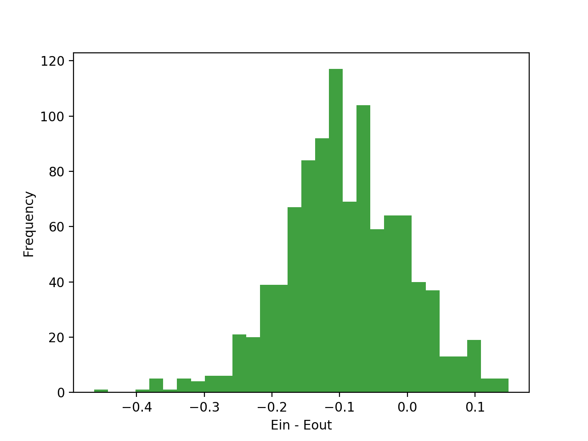

# MLF - HW2

###### By: B06902029 (Wu-Jun Pei)

### 1.

### 2.

We can know that $d_{VC} \ge 4 \Leftrightarrow$ there are some $4$ inputs we can shatter.

Consider $X = \{(0, 1), (1, 0), (0, -1), (-1, 0)\}$, four points on a unit circle.

- If none is `O`, we can draw a line somewhere else that contains none of these points.

- If there is only one `O`, we can find a thick line that is tangent to that point.

- If there are two `O`, no matter the two points are adjacent or not, we can simply line the two points that only them are contained in the thick line.
- If there are three `O`'s, we can draw on the three circles and leave the `X` alone.
- If there are four `O`'s, we can simply draw a very thick line that contains all the four points.

### 3.

*Discuss with 蔡秉辰.*

- First of all, we can rewrite $\alpha$ as a 4-base numbers. For example, $(13.875)_{10} = 3 \times 4^1 + 1 \times 4^0 + 3 \times 4^{-1} + 2 \times 4^{-2} = (31.32)_4$

- Secondly, if $x = 4^k$, then we can view $\alpha x$ as an operation that shift $\alpha$ leftward $k$ units in 4-base numbers. For example, if $\alpha = (31.32)_4, x = 4$, $\alpha x = (31.32)_4 \times 4 = (313.2)_4$.

- As for the $\mod 4$ part, we can view the operation as a mask that only sees the $4_0$ part and the decimal part. For example, $(31.32)_4 \mod 4 = (1.32)_4$
- For simplicity, we define $\text{sign}(0) = -1$. And we can find that if the coefficient on $4^0$ of $\alpha x$ is $0$, then $h_{\alpha}(x)$ must be $1$, if the coefficient on $4^0$ of $\alpha x$ is $1$, then $h_{\alpha}(x)$ must be $-1$.

For any finite $n$, there exist some $n$ inputs that we can shatter.

Let $X = \{x_i = 4^i \text{ for } 1 \le i \le n\}$ and $Y$ be any set composed by $\{-1, 1\}$. And we can yield an $\alpha$ with
$$
\alpha = \sum_{i = 1}^n 4^{-i} \times
\begin{cases}
0, &\text{if } y_i = 1\\
1, &\text{if } y_i = -1
\end{cases}
$$
Thus, we can shatter any finite $n$ inputs, $d_{VC} = \infin$.

### 4.

##### Prove by contradiction.

Assume that $d_{VC}(H_1\cap H_2) > d_{VC}(H_2)$. Let $n = d_{VC}(H_1\cap H_2)$ and $m = d_{VC}(H_2)$, we have $n > m$.

By definition of VC-Dimension, we know that $n$ inputs can be shattered by $H_1 \cap H_2$ while $n$ inputs cannot be shattered by $H_2$. However, we have $H_1 \cap H_2 \subset H_2$, so $n$ inputs must be shattered by $H_2$, contradicts to our assumption.

Thus, we have $d_{VC}(H_1\cap H_2) \le d_{VC}(H_2)$.

### 5.

We can observe that
$$
\begin{align*}
m_{H_1 \cup H_2}(N) &= m_{H_1}(N) +m_{H_2}(N) - m_{H_1 \cap H_2}(N) \\
&=(N + 1) + (N + 1) - 2 \\
&= 2N
\end{align*}
$$
since the intersection of $H_1 \cap H_2$ is all positive and all negative.

When $n = 2$, $m_{H_1 \cup H_2}(n) = 4 =2^2$, we know that $H_1 \cup H_2$ can shatter 3 inputs.

When $n = 3$, $m_{H_1 \cup H_2}(n) = 6 \neq 8 = 2^3$, thus we know that $H_1 \cup H_2$ can not shatter 3 inputs.

Therefore, we have $d_{VC}(H_1 \cup H_2) = 2$.

### 6.

We can observe that
$$
\begin{align*}
\mu &=
\begin{cases}
\frac {|\theta|} 2, &\text{if } s = 1 \\
1 - \frac {|\theta|} 2, &\text{if } s = -1
\end{cases} \\
&= \frac {s + 1} 2 \times (\frac {|\theta|} 2) + \frac {1 - s} 2 \times (1 - \frac {|\theta|} 2) \\
&=\frac{s(|\theta| - 1) + 1} 2
\end{align*}
$$
By *Problem 1 in Coursera*, we have
$$
E_{out} = \mu \lambda + (1 - \mu)(1 - \lambda)
$$
And $\lambda = 0.8$, we have
$$
\begin{align*}
E_{out} &= 0.8 \mu + 0.2 (1 - \mu) \\
&= 0.2 + 0.6 \mu \\
&= 0.2 + 0.3 + 0.3s(|\theta| - 1) \\
&= 0.5 + 0.3 s(|\theta| - 1)
\end{align*}
$$

### 7.

The average $E_{in} - E_{out}$ falls around $-0.95$. And it looks like a normal distribution!

