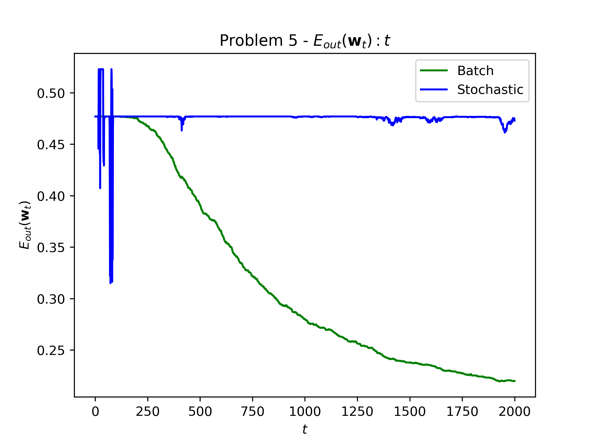

# MLF - HW3

##### By: Wu-Jun Pei (B06902029)

### Problem 1.

### Problem 2.

-   PLA
    $$
    \mathbf w_{t + 1} \leftarrow \mathbf w_t + [\![y_n \ne \text{sign}(\mathbf w_t^T \mathbf x_n)]\!] (y_n \mathbf x_n)
    $$

-   SGD
    $$
    \mathbf w_{t + 1} \leftarrow \mathbf w_t + \eta (-\nabla \text{err}(\mathbf w))
    $$
    

When $err(\mathbf w) = \max(0, -y \mathbf w^Tx)$,

- If $y \mathbf w^Tx \ge 0$, implies $\text{sign}(y) = \text{sign}(\mathbf w^Tx)$, the $err$ is zero in this case. Since we ignore the points that are not differentiable, the $\nabla err(\mathbf w)$ is zero, the $\mathbf w​$ does not change.
- Otherwise, $\text{sign}(y) \ne \text{sign}(\mathbf w^Tx)​$. The gradient of $err$ is $\nabla \text{err}(\mathbf w) = -y \mathbf w^T$, the $\mathbf w$ is going to be updated as
$$
\begin{align*}
\mathbf w_{t + 1} &\leftarrow \mathbf w_t + \eta (-\nabla \text{err}(\mathbf w)) \\
&= \mathbf w_t + \eta(-(-y\mathbf w^T)) \\
&= \mathbf w_t + \eta(y \mathbf w^T)
\end{align*}
$$
The SGD results the same as PLA when $\eta = 1$.

### Problem 3.

From problem 16 on Coursera, we've derived that
$$
E_{in} = \frac 1 N \sum_{n = 1}^N(\ln(\sum_{i = 1}^K \exp(\mathbf w_i^T x_n))- \mathbf w_{y_n}^T x_n)
$$

Thus, we can have
$$
\begin{align*}
\frac{\part E_{in}}{\part w_i}
&=	\frac{1}{N}\sum_{n = 1}^{N}(
	\frac{\part \ln(\sum_{i = 1}^K \exp(\mathbf w_i^T x_n))}{\part \sum_{i = 1}^K \exp(\mathbf w_i^T x_n)}
	\frac{\part \sum_{i = 1}^K \exp(\mathbf w_i^T x_n)}{\part \mathbf w_i}
	- [\![y_n = i]\!]x_n)
	,&\text{by Chain Rule}\\
&=	\frac{1}{N}\sum_{n = 1}^{N}(
	\frac{1}{\sum_{i = 1}^K\exp(\mathbf w_i^T x_n)}
	\exp(\mathbf w_i^T x_n) x_n
	- [\![y_n = i]\!]x_n)
	,&\text{Derivative}\\
&=	\frac{1}{N}\sum_{n = 1}^{N}(
	h_i(x_n)x_n
	- [\![y_n = i]\!]x_n) \\
&=	\frac{1}{N}\sum_{n = 1}^{N}((h_i(x_n) - [\![y_n = i]\!])x_n)
\end{align*}
$$

<h3 style="page-break-before: always">Problem 4.</h3>

#### My findings

1. The $E_{in}$ of Fixed rate Gradient Descent is monotonic while $E_{in}$ of SGD is not.
2. Generally speaking, the $E_{in}$ of Fixed rate Gradient Descent is smaller than the $E_{in}$ of SGD.
3. I think both *(1)* and *(2)* result from the fact that Fixed rate Gradient Descent takes much more computational resource ($O(N)$ time to update $\mathbf w_{t + 1}$ with all the testdata) than SGD takes ($O(1)$ time to update $\mathbf w_{t + 1}$ with one testdata).

<h3 style="page-break-before: always">Problem 5.</h3>

#### My findings

1. The $E_{out}$ of both the two versions for Gradient Descent are highly correlated with the $E_{in}$ but bigger than $E_{in}$. It is not a new news because we have the same finding in PLA/pocket algorithm we've learned.

2. I also conducted an experiment by increasing $T$ from $2000$ to $10000$. The following figures are the result of the experiment

   |                       $E_{in}$                        |                       $E_{out}$                        |
   | :---------------------------------------------------: | :----------------------------------------------------: |
   |  |  |

   1. Both $E_{in}$ and $E_{out}$ of Fixed rate Gradient Descent converges to around $0.20$.
   2. The $E_{in}$ and $E_{out}$ of SGD finally start to fall. And the curve seems to be periodic, I think the period interval might be the size of the training data ($1000$).

